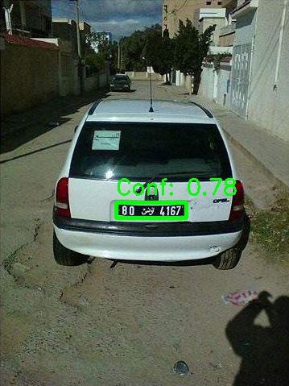
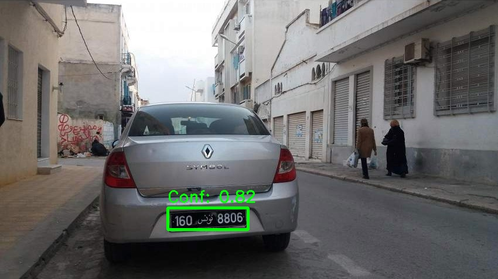
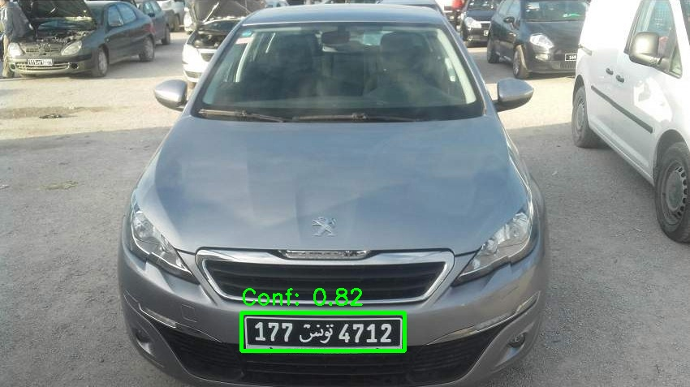

# License Plate Recognition System

A computer vision project implementing automated license plate detection and character recognition using deep learning techniques.

## Overview

This project was developed as part of my thesis work to explore practical applications of computer vision and deep learning. The system performs two main tasks:

1. **Detection:** Locates license plates in images using YOLOv8 object detection
2. **Recognition:** Extracts characters from detected plates using Optical Character Recognition (OCR)

The implementation handles both Arabic and English text, making it suitable for multi-language license plate systems.

## Motivation

This project aims to:
- Understand end-to-end object detection pipelines
- Learn preprocessing techniques for improved OCR accuracy
- Explore challenges in multi-language text recognition
- Build practical experience with modern deep learning frameworks

## Methodology

### 1. Dataset Preparation
- Collected 900 annotated license plate images
- Converted annotations to YOLO format
- Split data into 80% training and 20% validation sets

### 2. License Plate Detection
- **Model:** YOLOv8 Nano (pretrained)
- **Training:** 50 epochs with early stopping
- **Input Size:** 640x640 pixels
- **Output:** Bounding box coordinates with confidence scores

### 3. Character Recognition
- **Preprocessing Steps:**
  - Crop detected plate region
  - Resize to minimum 100px height
  - Convert to grayscale
  - Apply Binary Otsu thresholding
- **OCR Engine:** EasyOCR with Arabic and English language support
- **Post-processing:** Sort characters by spatial position (left to right)

## Technologies

- **YOLOv8:** State-of-the-art object detection framework
- **EasyOCR:** Deep learning-based OCR library
- **OpenCV:** Image processing and computer vision operations
- **Python:** Primary programming language
- **Google Colab:** Cloud-based development environment with GPU support

## Results

### Detection Performance
- Average detection confidence: ~81%
- mAP@0.5: 0.809
- Successfully detects plates in various lighting conditions

### OCR Performance
- Achieves 70-80% accuracy on mixed Arabic-English plates
- Binary Otsu thresholding provides best preprocessing results
- Handles spatial ordering of mixed-language text

## Sample Outputs

### Example 1


### Example 2


### Example 3


*Green bounding boxes show detected license plates with confidence scores*

## Challenges Encountered

1. **Text Ordering:** Arabic (right-to-left) and English numbers (left-to-right) require spatial sorting
2. **Image Quality:** Low resolution or blurry plates reduce OCR accuracy
3. **Lighting Variations:** Shadows and glare affect character recognition
4. **Mixed Languages:** Simultaneous recognition of Arabic and English characters

## Key Learnings

- Importance of preprocessing in OCR pipelines
- Trade-offs between model size and accuracy
- Practical challenges in real-world computer vision applications
- Impact of data quality on model performance

## Limitations

- OCR accuracy is sensitive to image quality and preprocessing
- Small or tilted plates may not be detected correctly
- No validation of plate format or country-specific patterns
- Limited to static images (not optimized for video)

## Future Work

- Experiment with custom OCR models for better accuracy
- Implement real-time video processing
- Add plate format validation for specific regions
- Explore data augmentation techniques for improved detection
- Test on diverse datasets with different plate types

## Project Structure
```
├── license_plate_recognition.ipynb    # Complete implementation
├── requirements.txt                   # Python dependencies
├── sample_results/                    # Example outputs
└── README.md                          # Documentation
```

## Technical Requirements
```
ultralytics      # YOLOv8 framework
easyocr          # OCR engine
opencv-python    # Image processing
numpy            # Numerical operations
pandas           # Data handling
matplotlib       # Visualization
```

## Acknowledgments

This project was completed as part of my thesis on computer vision applications. Special thanks to:
- Ultralytics for the YOLOv8 framework
- JaidedAI for the EasyOCR library
- The open-source computer vision community

## References

- YOLOv8: https://github.com/ultralytics/ultralytics
- EasyOCR: https://github.com/JaidedAI/EasyOCR
- OpenCV Documentation: https://docs.opencv.org/

---

**Note:** This is an educational project developed for learning purposes. The code and methodology are documented to help others understand the implementation of license plate recognition systems.

### Technical Addition
The project has been equipped with open cv and yolov8 so its defined as a learning project and this is not the original work. The future work may involve more robust models and improving performance but this will be the last addition to this code base. final addition.
Last addition and no more fluff

## API Integration
This project exposes a REST API endpoint for license plate detection. 
Send a POST request to `/detect` with an image file and receive the detected plate number, confidence score, and bounding box coordinates in response. Nothing to add more after this addition.
